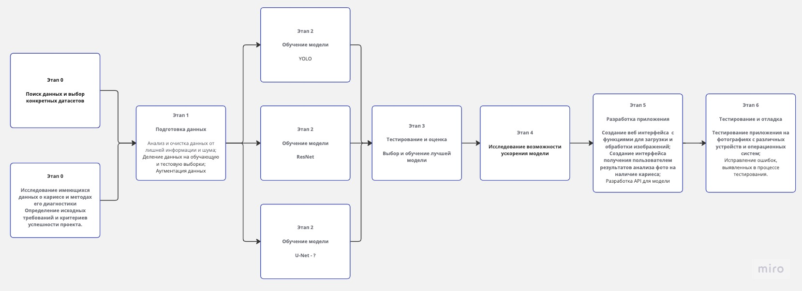
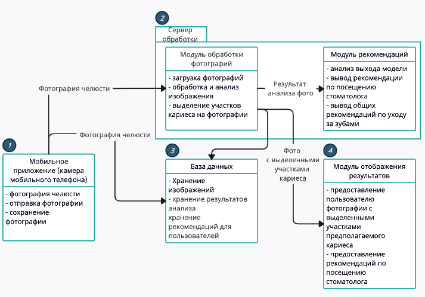
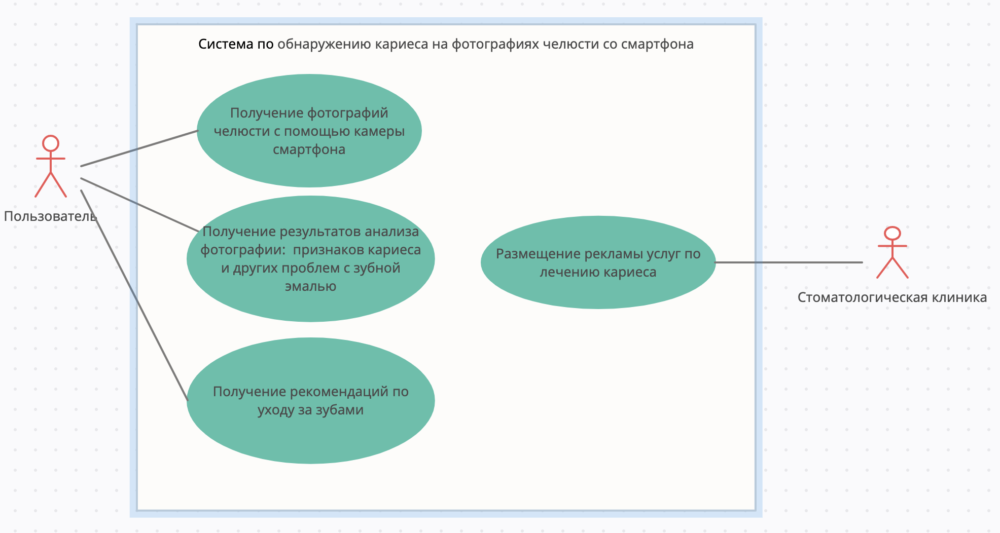
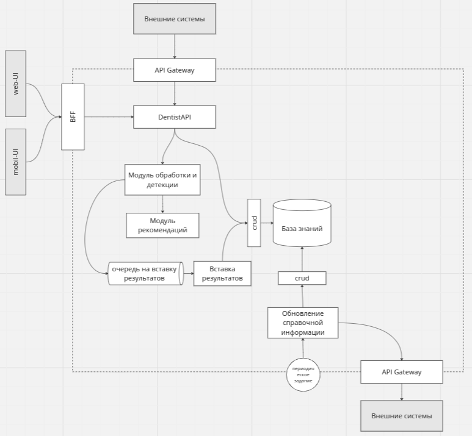
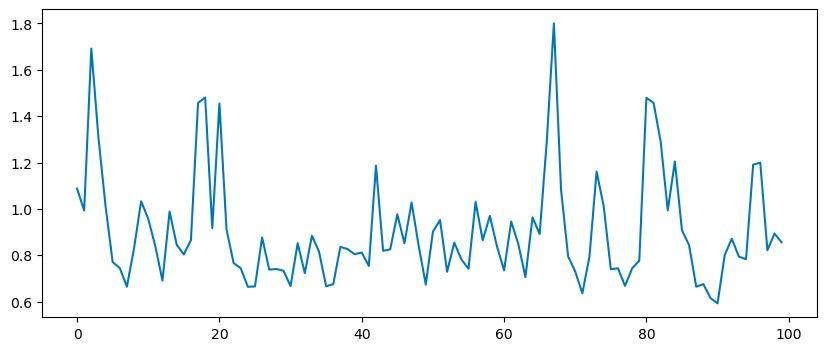

## Дизайн ML системы - Dentist AI v0.1

    
> ## Термины и пояснения
> - Итерация - это все работы, которые совершаются до старта очередного пилота  
> - БТ - бизнес-требования 
> - EDA - Exploratory Data Analysis - исследовательский анализ данных  
> - `Product Owner`,  `Data Scientist` - роли, которые заполняют соответствующие разделы 
> - В этом шаблоне роль `Data Scientist` совмещает в себе компетенции классического `Data Scientist` с упором на исследования и `ML Engineer` & `ML Ops` роли с акцентом на продуктивизацию моделей
> - Для вашей организации распределение ролей может быть уточнено в зависимости от операционной модели 

### 1. Цели и предпосылки 
#### 1.1. Зачем идем в разработку продукта?  

- Бизнес-цель: разработать сервис по обнаружению видимого кариеса на дентальных фотографиях человека (фото зубов), сделанных с помощью камеры мобильного телефона. Для внедрения в production добиться полноты (Recall) обнаружения кариеса не менее 79%. 
Дополнительно (по возможности для production): обеспечить сегментацию и вычисление процента видимого поражения зуба. 
Если говорить об ошибках срабатывания модели в терминах FP и FN, то для данной задачи большой FP не так страшен, как большой FN. В случае FP
получается, что мы просто перестраховываемся. Касаемо диагностики в медицине лучше пере, чем недо. Лучше перестраховаться.
В то же время большой FN приведет к тому, что мы пропускаем развитие заболевания зубов. Поэтому в качестве ML метрики взят Recall (у которого FN в знаменателе) - с точки зрения пользователя нам важно выявить кариес на ранних стадиях,
когда его можно лечить довольно легко, а само лечение обходится в разы дешевле, и приводит к меньшим потерям для зуба чем на поздних стадиях кариеса, когда приходится вычищать большие площади поврежденные кариесом. 
Если рассматривать монетизацию не через подписку, а через партнерство с клиниками, то метрика - это количество посещений пациентами клиники после нашей рекомендации. Здесь тоже  подходит Recall - как метрика отвечающая за способность обнаруживать класс, как таковой и при подозрениях отправлять людей проверяться, что увеличивает поток пациентов.
- Почему станет лучше, чем сейчас, от использования ML: посещать стоматолога хотя бы просто для профилактического осмотра рекомендуют не реже 1 раза в полгода.
Пользователи смогут удобно контролировать состояние своих зубов даже в случае отсутствия возможности посетить стоматолога (нехватка времени, страх, высокая стоимость, отсутствие мест для записи на удобное время, ничего не беспокоит и т.д.), получать рекомендации о посещении специалиста уже на ранних этапах развития кариеса.

#### 1.2. Бизнес-требования и ограничения  
##### Требования и ограничения:
1. Определять наличие/подозрения на кариес по фотографии зубов.
2. Модель должна работать с фотографиями, сделанными на камеру современного (2-3 года) смартфона. При этом разрешение камеры должно быть не меньше 5 мегапикселей, а апертура не меньше f/1.8. Для максимального удобства фотографирования зубов в режиме селфи у смартфона должна быть фронтальная камера.
3. Наличие малейшего подозрения на кариес сопровождается рекомендацией обратиться к врачу.
4. Скорость работы сервиса не должно превышать 5 сек (время замеряется на клиенте).
5. На стадии POC фото загружаются по одному за раз.

##### Общая логика работы:
На стадии POC рассматривается схема с "тонким" клиентом.
В качестве интерфейсной части выступает web-страница, на которой есть возможность загрузить изображение зубов и получить обработанное изображение.
На полученном назад изображении будут выделены те участки зубов, на которых модель подозревает наличие кариеса. 
##### Что будем считать успехом итерации?
Успехом итерации будем считать работающую модель, позволяющую по дентальной фотографии человека получить ограничивающие прямоугольники, выделяющие участки с кариесом.
##### Описание бизнес-процесса пилота
Основой БП пилота будет контроль результатов со стороны дипломированного специалиста и будет состоять из следующих шагов:
1. Подбор и анализ данных
2. Формирование train/test/val выборок и очистка датасета
3. Выбор целевой метрики
4. Создание сервиса
5. Визуальный контроль со стороны дипломированного специлиста

#### 1.3. Потенциальное расширение системы:
1. Использование второй модели для реализации двустадийного подхода для увеличения точности детекции. Первая модель будет искать зубы, вторая модель будет искать кариес только внутри области найденной первой моделью.
1. Перенос UI в приложение для смартфона
2. Возможность анализировать несколько изображений с разных ракурсов и выдавать взвешенную оценку
3. Умение различать дентальные фотографии взрослых и детей и выдавать рекомендации с учетом этого
4. Умение диференцировать различные стадии кариеса
5. Расширение набора классов детекции, т.е. зубных болезней 
6. Создание личного кабинета пользователя с историей загрузок, данными о личном стоматологе или клинике 
7. Онлан консультация/верификация у стоматолога 
8. Запись в стоматологию через приложение 
9. Проработка нескольких путей монетизации:
   1. Пользовательская подписка
   2. Партнерская программа с клиникой
   3. SaaS продажа услуг клиникам для встраивания в их приложения
   4. Комбинированный: подписка на сервис предоставляет скидку на посещение клиники, при условии записи через приложение

### 2. Стек технологий
- Среда:
  - Разработка на ПК участников проекта + ресурсы colab
  - Развертывание: на dev-сервере Intel(R) Core(TM) i5-7400 CPU @ 3.00GHz, 15GB RAM, GeForce RTX 2060 Rev.A (5934MiB)
- Стэк-технологий: Python, FastAPI, pytorch, Wandb, YOLO
- Данные: для текущей итерации использовались открытые данные с соревнований kaggle, данные с roboflow.com:

| Ресурс     | Ссылка на датасет                                                                                                                                                                                                                                                                                                                                                                                                                                                                                                                                                                                                                                                                                                                                                                                                                                                                                                                                                                                                                                                                                                                                                                                                                                                                                                                               |
|------------|-------------------------------------------------------------------------------------------------------------------------------------------------------------------------------------------------------------------------------------------------------------------------------------------------------------------------------------------------------------------------------------------------------------------------------------------------------------------------------------------------------------------------------------------------------------------------------------------------------------------------------------------------------------------------------------------------------------------------------------------------------------------------------------------------------------------------------------------------------------------------------------------------------------------------------------------------------------------------------------------------------------------------------------------------------------------------------------------------------------------------------------------------------------------------------------------------------------------------------------------------------------------------------------------------------------------------------------------------|
| roboflow.com | [caries-e8k9g](https://universe.roboflow.com/school-waoxh/caries-e8k9g)  [dataset/1](https://universe.roboflow.com/college-gl4rb/norma-l/dataset/1)[tteth](https://universe.roboflow.com/k-nybrl/tteth) [dental-disease-detection-xqalp](https://universe.roboflow.com/rizka-milandga-2k04u/dental-disease-detection-xqalp) [our](https://universe.roboflow.com/111-j3wer/our) [yolo-conversion-fbsju](https://universe.roboflow.com/yolo-lgmeg/yolo-conversion-fbsju) [toothcaries](https://universe.roboflow.com/odontoapp/toothcaries) [xd_2](https://universe.roboflow.com/111-j3wer/xd_2) [proyecto-deteccion-de-enfermedades-dentales](https://universe.roboflow.com/proyecto-odontologia/proyecto-deteccion-de-enfermedades-dentales) [caries-scjtb](https://universe.roboflow.com/vitekthebest/caries-scjtb) [mega-thoart-data](https://universe.roboflow.com/vitekthebest/mega-thoart-data/) [dentasis](https://universe.roboflow.com/dentasis/dentasis) [dental-project-bvtip](https://universe.roboflow.com/dental-project-fcai/dental-project-bvtip) [occlusal-caries-detection-olf03](https://universe.roboflow.com/predict-caries-1/occlusal-caries-detection-olf03/)  [caries-detection-euzne](https://universe.roboflow.com/digital-health-bg/caries-detection-euzne)   [dental-app](https://universe.roboflow.com/dental-app/dental-app) |
|      kaggle.com      | [teeth-dataset](https://www.kaggle.com/datasets/pushkar34/teeth-dataset) [oral-diseases](https://www.kaggle.com/datasets/salmansajid05/oral-diseases)                                                                                                                                                                                                                                                                                                                                                                                                                                                                                                                                                                                                                                                                                                                                                                                                                                                                                                                                                                                                                                                                                                                                                                                       |
|     zenodo.org       | [record/4907880](https://zenodo.org/record/4907880)                                                                                                                                                                                                                                                                                                                                                                                                                                                                                                                                                                                                                                                                                                                                                                                                                                                                                                                                                                                                                                                                                                                                                                                                                                                                                                           |

#### 2.1. Что входит в скоуп проекта/итерации, что не входит   

- Будет закрыто: Создание web-сервиса, позволяющего подтвердить гипотезу, что возможно с приемлемым качеством обнаруживать кариес на снимках со смартфона.
- Что не будет закрыто: хранение фото в базе, хранение результатов анализа, хранение рекомендаций для пользователей, предоставление развернутых рекомендаций по посещению стоматолога, вывод общих рекомендаций по уходу за зубами, создание мобильного приложения, классификация различных степеней кариеса, ведение истории наблюдений, классификация различных заболеваний полости рта. 

#### 2.2. Предпосылки решения  
1) Желание контролировать состояние своих зубов/зубов своих детей не выходя из дома.
2) Отсутсвие времени/желания периодически посещать стоматолога для профилактического осмотра. 
3) Наличие открытых датасетов по кариесу. 
4) Модели семейства YOLO достаточно быстрые и часто используются для задач детекции. Хороший вариант для бейзлайна.

### 3. Методология

#### 3.1. Постановка задачи  
V1.0:
1. Обученная модель по детекции на фото областей зубов с кариесом: 1 класс "Кариес"
2. Веб API для инференса модели
3. Web UI для проверки работы на пользовательском уровне
4. Входные данные: rgb-изображение в формате png/jpg, сделанные пользователем на камеру своего смартфона
5. Выходные данные: rgb-изображение с наложенными ограничивающими рамками указывающими на участки с подозрением на кариес

#### 3.2. Блок-схема решения  

Подготовка решения состоит из 7и основных этапов:
- ЭТАП 0. Исследовательский: поиск и изучение данных, изучение методов диагностики кариеса
- ЭТАП 1. EDA - анализ и очистка данных, формирование датасета
- ЭТАП 2. Обучение моделей
- ЭТАП 3. Тестирование моделей и оценка результатов (возврат к ЭТАПАМ 1, 2)
- ЭТАП 4. Подготовка к инференсу: анализ скоростных характеристик, исследование возможностей по ускорению/уменьшению модели
- ЭТАП 5. Подготовка инференса: создание API, интерфейсав, классов по использованию модели
- ЭТАП 6. Тестирование и отладака: тестирование приложения как разработчиками, так и экспертами и пользователями

#### 3.3. Этапы решения задачи  
   
**Этап 1 - поиск, выбор и анализ датасетов, подготовка данных для обучения моделей.**

Требования к данным:
Фотографии открытого рта, так чтобы были видны зубы верхней или нижней челюсти (или обеих сразу). Качество фото должно быть такого уровня
чтобы визуально можно было разглядеть зубы и их дефекты, если они есть.
В качестве основного источника данных было принято решение использовать ресурс roboflow. Так как только там имелись данные в необходимом количестве.
На roboflow было проанализировано большое количество открытых датасетов. Часть из них была признана потенциально пригодными для использования.  

| Название датасета              | Ссылка на датасет                                                                              | Размер датасета | Описание                                                             | Подходит?                                                                                                                 |
|--------------------------------|------------------------------------------------------------------------------------------------|-----------------|----------------------------------------------------------------------|---------------------------------------------------------------------------------------------------------------------------|
| dental-app                     | https://universe.roboflow.com/dental-app/dental-app                                            | 32/167          | Кариес, диастемы, пятна и т.д.                                       | Только, как вспомогательный набор. Требуется полная переразметка                                                          |
| occlusal-caries-detection      | https://universe.roboflow.com/predict-caries-1/occlusal-caries-detection-olf03/                | 56/61           | Кариес.                                                              | Только, как вспомогательный набор. Требуется полная переразметка                                                          |
| dental-project-bvtip           | https://universe.roboflow.com/dental-project-fcai/dental-project-bvtip                         | 463/1691        | Кариес, гингивит, абсцесс и т.д. Без меток 0                         | Нет. Слишком крупный план съемок.                                                                                         |
| dentasis                       | https://universe.roboflow.com/dentasis/dentasis                                                | 509/1129        | Кариес 2 вида  без меток 612                                         | Подойдёт. Наиболее адекватный датасет из всех, что приходилось смотреть. Но нужна будет чистка и переразметка.            |
| mega-throat-data               | https://universe.roboflow.com/vitekthebest/mega-thoart-data/                                   | 544/1864        | Кариес. Без меток 0 есть метки зубов (детские фото)                  | Только, как вспомогательный набор. Придётся переразмечать                                                                 |
| caries-scjtb                   | https://universe.roboflow.com/vitekthebest/caries-scjtb                                        | 296/410         | Кариес. Без меток 4. Есть метки зубов (детские фото)                 | Нет. Придётся чистить и удалять большую часть данных. То, что осталось придётся переразмечать.                            |
| deenfermedades-dental          | https://universe.roboflow.com/proyecto-odontologia/proyecto-deteccion-de-enfermedades-dentales | 76/204          | Кариес, язвы во рту. Без меток 4 (yolo8 нет)                         | Разметка под сегментацию. Придется чистить и полностью переразмечать                                                      |
| xd_2                           | https://universe.roboflow.com/111-j3wer/xd_2                                                   | 448/900         | Кариес. Без меток 452 фото. (детские фото)                           | Только, как вспомогательный набор. Придётся чистить и переразмечать                                                       |
| toothcaries                    | https://universe.roboflow.com/odontoapp/toothcaries                                            | 201/201         | Кариес (yolo8 нет)                                                   | Разметка под сегментацию. Придется полностью переразмечать                                                                |
| yolo-convertion-fbsju          | https://universe.roboflow.com/yolo-lgmeg/yolo-conversion-fbsju                                 | 424             | Кариес, пломбы, коронки и т.д.                                       | Частично. Придётся чистить и переразмечать                                                                                |
| 111-j3wer                      | https://universe.roboflow.com/111-j3wer/our                                                    | 56              | только кариес (детские фото)                                         | Только, как вспомогательный набор. Придётся переразмечать                                                                 |
| dentasis v30                   | https://universe.roboflow.com/dentasisv30/dental_caries_detection_2/                           | 476             | Кариес. Очищенная версия dentasis                                    | Датасет взят в качестве базового для проведения экспериментов по обучению моделей                                         |
| dental-disease-detection       | https://universe.roboflow.com/rizka-milandga-2k04u/dental-disease-detection-xqalp              | 43/204          | Кариес                                                               | Только, как вспомогательный набор. Придётся переразмечать                                                                 |
| dentasis_dental_disease_occlus | https://universe.roboflow.com/dentasisv30/dentasis_dental_disease_occlus/                      | 575             | Кариес. Объединение трех очищенных и частично размеченных датасетов. | Подходит. Этот набор был создан, как объединение трёх других.                                                             |
| tteth                          | https://universe.roboflow.com/k-nybrl/tteth                                                    | 291             | Здоровые зубы (в основном)                                           | Подходит. После чистки оставим только фото здоровых зубов. Будем использовать, как background images, для снижения FP     |
| norma-l                        | https://universe.roboflow.com/college-gl4rb/norma-l/dataset/1                                  | 115             | Здоровые зубы (в основном)                                           | Подходит, как background images. После чистки оставим только фото здоровых зубов. Частично пересекается с датасетом tteth |
| aug dentasis_dental_disease_occlus| https://universe.roboflow.com/dentasisv30/dentasis_dental_disease_occlus/dataset/2          | 1655            | Кариес.                                                              | Аугментированный поворотами, сдвигами и отражением базовый датасет.                                                       |  

EDA показал, что данные всех датасетов очень плохо размечены, есть много неподходящих фото.
- Необходимо отобрать фотографии, на которых хорошо видны зубы и корректная разметка.
- Часть данных придётся переразметить (так как bbox меньше/больше, чем нужно либо вообще не там, где надо).

 Для перехода на следующий этап необходимо собрать датасет не менее:

 1) Для бейзлайна - до 500 изображений.
 2) Для MVP - от 1500 и больше изображений.

После нескольких итераций очистки и переразметки был собран датасет, названный базовым.
Он является объединением открытых датасетов dentasisv30, Occlusal caries detection, Dental disease detection и содержит 575 фото.
Но мы считаем, что необходимо продолжить очистку, переразметку новых данных и их добавление в базовый датасет для улучшения качества работы моделей. 

Всего было собрано 8 датасетов:

| Наименование | Количество файлов | Коммментарий                                        | 
|--------------|-------------------|-----------------------------------------------------|
| dentasis_v32i_Caries_v0        | 9539              | базовый датасет: очень грязный                      |
| xd_n.v1i_Caries_v0        | 911               | эксперименты со сторонними датасетами               |
| dentasis_v30_Caries_v0         | 953               |   эксперименты со сторонними датасетами: переразметка                                                  |
| dentasis_v30_2_Caries_v0  | 953               | пересборка  dentasis_v30_Caries_v0                  |
| dentasis_v30_2_Occlus_Caries_v0| 1113              | эксперименты со сторонними датасетами: переразметка |
| dentasis_v30_3_Caries_v0         | 953               | переразметка  dentasis_v30_Caries_v0                |
| dentasis_v30_4_Dental_disease_detection_Occlus | 1151              | эксперименты со сторонними датасетами: переразметка |
| dentasis_v30_5_Dental_disease_detection_Occlus | 1178              | переразметка и добавление примеров в dentasis_v30_4_Dental_disease_detection_Occlus               |

Риски и проблемы:
1) Плохое качество фото и разметки в датасетах, загрязненные данные (невалидные фото).
2) На очистку и переразметку датасетов уходит очень много времени.
3) Скорость инференса.
4) Аппаратные средства при обучении: ограничения видеокарты влияюит на размер батча

**Этап 2 - разработка пайплайна загрузки и аугментации изображений**

- Работа с датасетом: формирование датасета, его разметка, аугментация, добавление и удаление примеров велась на [roboflow](https://roboflow.com/) и на пк членов команды.
- Архитектура: YOLO ([Ultralytics](https://docs.ultralytics.com/)) + встроенная аугментация
- Треккинг экспериментов: [Wandb](https://wandb.ai/dentist_ai/Dentist_AI/table?workspace=user-)

1) Для бейзлайна - пока что сбор данных проводился именно для бейзлайновой модели.
2) Для MVP - требуется увеличить имеющийся базовый датасет, более точная разметка при консультции дипломрованного специалиста

**Риски и проблемы:**

1) Малое количество нормальных данных. 
2) При небольшом размере базового датасета аугментации могут не помочь в задаче увеличения качества работы модели.

**Этап 3 - обучение и сравнение моделей детекции**

В качестве бейзлайна было принято решение использовать модель YOLO5.
Также в качестве альтернативы была выбрана модель YOLO8.
Эксперименты по обучению этих моделей показали, что YOLO5 превосходила YOLO8 на несколько процентов по метрикам Precision и Recall.

Таблица сравнения моделей:

| Модель  |  Precision | Recall    | 
|---------|------------|-----------|
| YOLO5   | 0.521      |  0.432    |
| YOLO8   | 0.456      |  0.368    | 

1) Бейзлайн - YOLO5.
2) MVP - скорее всего будет тоже YOLO5.

**Этап 4 - подготовка инференса модели**

В рамках подготовки инференса был создан пайплайн для конвертации весов модели из формата pt в формат ONNX.
А также пайплайн загрузки и инференса модели в формате ONNNX. 

1) Бейзлайн - ONNX формат.
2) MVP - ONNX формат.

Описание техники: 

1. Описание формирования выборки для обучения, тестирования и валидации:

MVP: Для формирования выборки для обучения модели будет использоваться набор анонимизированных дентальных фотографий людей с различными степенями кариеса. Данные будут собираться из различных открытых источников, разметка перепроверяться на отложенной для теста подвыборке.

Baseline: Аналогичный подход будет применен и для базовой модели. 

2. Горизонт, гранулярность, частоту пересчета прогностических моделей:

MVP: Для MVP модели прогнозирования кариеса на фотографиях зубов горизонт прогнозирования будет составлять один год, с частотой пересчета модели каждые 6 месяцев.

Baseline: Тот же горизонт и частота пересчета будут применены для базовой модели.

3. Определение целевой переменной:

MVP: Целевая переменная - наличие или отсутствие кариеса на фотографии зубов.

Baseline: Та же целевая переменная будет использована для базовой модели.

4. Используемые метрики качества:

MVP: Метрики качества модели включают в себя Precision и Recall, так как они позволяют оценить эффективность выявления кариеса на фото зубов. 
При этом, с точки зрения бизнеса основной метрикой на начальном этапе будет являться Acquisition (привлечение) - это метрика, которая отражает количество новых клиентов или пользователей, привлеченных благодаря использованию приложения. Отсюда основным показателем модели на первом этапе является полнота обнаружения кариеса (Recall) - как прокси-метрика привлечения.

Baseline: Для базовой модели будут использованы метрики Precision и Recall.

5. Необходимый результат этапа:

MVP: Необходимым результатом будет достижение 
Recall >=0.4
Precision >= 0.3

Baseline: Для базовой модели также необходимо достижение высоких значений Precision и Recall.

6. Риски и планы по их устранению:

MVP: Риском может быть недостаточное количество данных для обучения модели. Планируем решить этот риск путем расширения источников данных и улучшения процесса сбора информации, а также использованием аугментаций имеющихся данных.

Baseline: Тот же риск, и такое же решение.

7. Feature engineering, алгоритмы, кросс-валидация:

MVP: Будут применены различные техники feature engineering, такие как извлечение признаков изображений. Для обучения модели будут использованы глубокие нейронные сети и возможно ансамбли моделей.

Baseline: Те же техники feature engineering и алгоритмы будут использованы для базовой модели.

8. Бизнес-проверка результата:

MVP: Результаты модели будут проверены сотрудниками стоматологической компании для оценки и подтверждения точности выявления кариеса на фотографиях.

Baseline: На этом этапе проверка модели осуществляется силами самой команды разработчиков.
  
### 4. Подготовка пилота  
  
#### 4.1. Способ оценки пилота  
  
Оценка пилота происходит в несколько стадий:
1. Автоматические тесты с применением кроспроверок и строгим вылелением test-выборки
2. Визуальный контроль со стороны дипломированного специлиста
  
#### 4.2. Что считаем успешным пилотом  
  
Успехом пилота будем считать работающий сервис с возможностью загрузить дентальные фотографию людей и получить ответ об обнаружении на снимке кариеса с необходимой полнотой обнаружения.
Пользователь сможет получить первые результаты работы сервиса и обратиться к врачу в случае выявления проблем с зубами.
  
#### 4.3. Подготовка пилота  

Для запуска пилота потребуется:

- Перенос сервиса с dev-сервера на облачную ВМ с арендованным графическим ускорителем.
- Деплой на основе докер образов.
- Развертывание пилотной версии происходит в kind на одной ВМ.

### 5. Внедрение `для production систем, если требуется`    

> Заполнение раздела 4 требуется не для всех дизайн документов. В некоторых случаях результатом итерации может быть расчет каких-то значений, далее используемых в бизнес-процессе для пилота.  
  
#### 5.1. Архитектура решения   
  
- Блок схема и пояснения: сервисы, назначения, методы API 
- Диаграмма компонентов решения:

- Диаграмма вариантов использования:

Для детекции кариеса пользователю необходимо сделать фотографию интересующей его области:
передней/щечной справа/щечной слева группы зубов, верхнечелюстной/нижнечелюстной плоскости прикуса с помощью камеры смартфона. Перед фотосъемкой желательно минимизировать присутствие слюны во рту.
Для фото передней/щечной группы зубов камеру желательно распологать параллельно плоскости губ/щек с максимально возможным захватом интересующей пользователя области зубов.
Для фото верхней и нижней челюсти желательно чтобы угол между плоскостью экрана смартфона и плоскостью верхнего/нижнего прикуса был, как можно меньше с учетом максимального охвата интересующей области зубов.
Для облегчения процесса фотографирования пользователю могут быть показаны смоделированные примеры необходимых изображений.

Рекомендации по созданию дентальной фотографии:

| Вид                                | Область фокусировки камеры       | Средняя линия фото по горизонтали | Средняя линия фото по вертикали |
|------------------------------------|----------------------------------|-----------------------------------|---------------------------------|
| Передняя группа зубов              | Медиальные или латеральные резцы | Плоскость прикуса                 | Анатомическая средняя линия     |
| Щечная группа справа               | Клык или премоляры               | Плоскость прикуса                 | Клык или премоляры              |
| Щечная группа слева                | Клык или премоляры               | Плоскость прикуса                 | Клык или премоляры              |
| Верхнечелюстная плоскость прикуса  | Премоляры                        | Клык или премоляры                | Анатомическая средняя линия     |
| Нижнечелюстная плоскость прикуса   | Премоляры                        | Клык или премоляры                | Анатомическая средняя линия     |
  
#### 5.2. Описание инфраструктуры и масштабируемости 
  
- Инфраструктура:
  - Облачная ВМ с арендованным графическим ускорителем. Деплой на основе докер образов. Развертывание пилотной версии происходит в kind на одной ВМ.
  - Целевое разделение на сервисы:
  
    
- Плюсы такой инфраструктуры:
  1. Низкая стоимость на старте - нет необходимости сразу покупать ресурсы.
  2. Высокая отказоустойчивость и быстрая масштабируемость
  3. Kind позволяет сразу подготовить конфигурацию компонент, готовую к переносу на полноценный кластер (при необходимости)
  4. Облачная инфраструктура позволяет динамически регулировать выделение ресурсов и не их избыточность на старте

#### 5.3. Нагрузочное тестирование

На текущем этапе в качестве нагрузочного тестирования сервису отправлялась серия запросов посредством скрипта, и при этом подсчитывалось время ответа.
По оси x номер запроса. Результаты на графике. По оси y время ответа на запрос.

В дальнейшем потребуются:

1) Тесты на стабильность: для проверки работоспособности на длительном промежутке времени.
2) Тесты объема: проверка работы при увеличении количества пользователей.
3) Тест масштабируемости: проверка насколько быстро происходит развертывание в облаке.

  
#### 5.4. Требования к работе системы  
  
- SLA - 5 сек на обработку одного изображения
- пропускная способность: пилот - 100 изображений в сутки
  
#### 5.5. Безопасность системы  
  
- На текущей итерации работа сервиса по детекцию кариеса не предполагает хранение какой-то информации о пользователе (фото, ФИО, адрес, телефон ит.д.)
поэтому утечка таких данных со стороны системы исключена.
- Потенциальная уязвимость:
  Уязвимость облачной платформы, на которой будет работать сервис.
- В дальнейшем возможная уязвимость к утечке пользовательских данных.
  
#### 5.6. Безопасность данных   
  
- Согласно 152-ФЗ от 27.07.2006 "О персональных данных" фотография является персональными биометрическими данными
только в том случае, если она используется оператором для идентификации личности.
На текущей итерации работа сервиса предполагает отправку
фото в обезличенном виде - без указания ФИО и других данных, которые вместе с фото позволили бы идентифицировать личность 
отправителя. Кроме того, на текущей итерации работа сервиса не предполагает хранение полученных фото. Поэтому закон о персональных данных не нарушается.
- При дальнейшем развитии проекта и добавлении опций хранения фото и хранения рекомендаций стоит уделить особое внимание безопасности хранения пользовательских данных.
Также нужно будет добавить форму согласия на обработку и хранение персональных данных.
  
#### 5.7. Издержки  
  
- Затраты на облачную инфраструктуру.
- Оплата труда специалистов по разработке и поддержке. 
  
  
#### 5.8. Риски  
  
- Низкое качество детекции из-за маленького объема данных для обучения и их плохого качества.
- Замедление скорости интернета и, как результат более долгая передача данных. 
- Изменение законодательства в сфере обработки биометрических и персональных данных. 